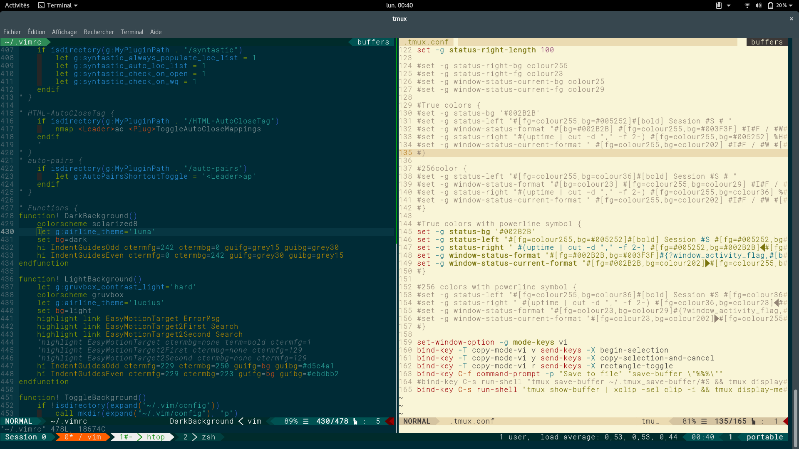

tmux-gigix
==========

- [tmux-gigix](#tmux-gigix)
  * [Presentation](#presentation)
  * [Requirements](#requirements)
  * [tmux.conf](#tmuxconf)
- [Putty support](#putty-support)
- [ZSH](#zsh)
- [Key mapping](#key-mapping)


Presentation
------------
Configuration file for tmux integration with [vim-gigix](https://github.com/gigi206/vim-gigix/)




Requirements
-----------
* Install tmux 2.5+
* Install [powerline fonts](https://github.com/powerline/fonts)
* Install [vim-gigix](https://github.com/gigi206/vim-gigix/) (optionnal)
* install [oh-my-zsh](https://github.com/robbyrussell/oh-my-zsh) (recommended)
  * Install plugins [zsh-syntax-highlighting](https://github.com/zsh-users/zsh-syntax-highlighting) and [zsh-autosuggestions](https://github.com/zsh-users/zsh-autosuggestions) (optionnal)
* install xclip (optionnal)


Docker for testing
------------------
If you have Docker installed on your system you can build or installed the Docker image.

#### Build yourself the Docker image
```sh
docker build -t tmux-gigix http://raw.githubusercontent.com/gigi206/docker/master/Dockerfile/vim-gigix_tmux-gigix/Dockerfile
docker run --rm -it --name tmux-gigix -e TERM=xterm-256color tmux-gigix tmux -2u new -s tmux-gigix 'zsh'
```

#### Use the prebuild Docker image
```sh
docker pull gigi206/vim-gigix
docker run --rm -it --name tmux-gigix -e TERM=xterm-256color gigi206/vim-gigix tmux -2u new -s tmux-gigix 'zsh'
```


tmux.conf
---------
Put [tmux.conf](tmux.conf) in **~/.tmux.conf** or **/etc/tmux.conf**.


Putty support
-------------
If you use tmux with **Putty**, you should install this [Putty reg file](https://github.com/gigi206/vim-gigix/blob/master/Putty/putty.reg) for compatibility colors.

Use [Putty 0.71](https://www.chiark.greenend.org.uk/~sgtatham/putty/releases/0.70.html) minimal release to have true color compatibility. At the time I wrote these lines, Putty 0.71 was not been released and you must download the [snapshot release](https://www.chiark.greenend.org.uk/~sgtatham/putty/snapshot.html) that contain the [true (24-bit) color patch](https://www.chiark.greenend.org.uk/~sgtatham/putty/wishlist/true-colour.html).


ZSH
---
If you have installed [oh-my-zsh](http://ohmyz.sh/) .


### .zshrc
Edit your _**~./zshrc**_ and modify like below :
```zsh
plugins=([...] zsh-syntax-highlighting zsh-autosuggestions)
# https://github.com/zsh-users/zsh-autosuggestions => $ZSH_CUSTOM/plugins
# https://github.com/zsh-users/zsh-syntax-highlighting => $ZSH_CUSTOM/plugins

# GigiX
local ret_status="%(?:%{$fg_bold[green]%}➜ :%{$fg_bold[red]%}➜ %s)"
PROMPT='%{$fg[green]%}%n%{$fg[white]%}@%{$fg[magenta]%}%m%{$fg[white]%}:%{$fg[cyan]%}%~%{$reset_color%} ${ret_status}$(git_prompt_info)%{$reset_color%}'
```
Move plugins [zsh-syntax-highlighting](https://github.com/zsh-users/zsh-syntax-highlighting) and [zsh-autosuggestions](https://github.com/zsh-users/zsh-autosuggestions) in **_$ZSH_CUSTOM/plugins_**.


### custom scripts
Script [demo.zsh](demo.zsh) script :
  * Rebind some keys
  * force tab to 4 spaces (for compatibility with [vim-gigix](https://github.com/gigi206/vim-gigix/))

Put this script in **$ZSH_CUSTOM** directory.


Key mapping
-----------
Default prefix haven't changed `C-b`
I put a second prefix `C-x`

All default prefix have been kept.

For see all key mapping press`<prefix> ?`

| Command             | Alias     | Keystrokes                                                                                                                                                                                           | Description                                                 |
|---------------------|-----------|------------------------------------------------------------------------------------------------------------------------------------------------------------------------------------------------------|-------------------------------------------------------------|
| attach-session      | attach    |                                                                                                                                                                                                      | attach or switch to a session                               |
| bind-key            | bind      |                                                                                                                                                                                                      | bind a key to a command                                     |
| break-pane          | breakp    | `<prefix>!`                                                                                                                                                                                          | break a pane from an existing into a new window             |
| capture-pane        | capturep  |                                                                                                                                                                                                      | capture the contents of a pane to a buffer                  |
| choose-buffer       |           | `<prefix>=`                                                                                                                                                                                          | put a window into buffer choice mode                        |
| choose-client       |           | `<prefix>D`                                                                                                                                                                                          | put a window into client choice mode                        |
| choose-session      |           |                                                                                                                                                                                                      | put a window into session choice mode                       |
| choose-tree         |           | `<prefix>s`                                                                                                                                                                                          | put a window into tree choice mode                          |
| choose-window       |           | `<prefix>w`                                                                                                                                                                                          | put a window into window choice mode                        |
| clear-history       | clearhist |                                                                                                                                                                                                      | remove and clear history for a pane                         |
| clock-mode          |           | `<prefix>t`                                                                                                                                                                                          | enter clock mode                                            |
| command-prompt      |           | `<prefix>:`                                                                                                                                                                                          | open the tmux command prompt in a client                    |
| confirm-before      | confirm   |                                                                                                                                                                                                      | run a command but ask for confirmation before               |
| copy-mode           |           | `<prefix>[`                                                                                                                                                                                          | enter copy mode                                             |
| delete-buffer       | deleteb   | `<prefix>-`                                                                                                                                                                                          | delete a paste buffer                                       |
| detach-client       | detach    | `<prefix>d`                                                                                                                                                                                          | detach a client from the server                             |
| display-message     | display   | `<prefix>i`                                                                                                                                                                                          | display a message in the status line                        |
| display-panes       | displayp  | `<prefix>q`                                                                                                                                                                                          | display an indicator for each visible pane                  |
| find-window         | findw     | `<prefix>f`                                                                                                                                                                                          | search for a pattern in windows                             |
| has-session         | has       |                                                                                                                                                                                                      | check and report if a session exists on the server          |
| if-shell            | if        |                                                                                                                                                                                                      | execute a tmux command if a shell-command succeeded         |
| join-pane           | joinp     |                                                                                                                                                                                                      | split a pane and move an existing one into the new space    |
| kill-pane           | killp     | `<prefix>x`                                                                                                                                                                                          | destroy a given pane                                        |
| kill-server         |           |                                                                                                                                                                                                      | kill clients, sessions and server                           |
| kill-session        |           |                                                                                                                                                                                                      | destroy a given session                                     |
| kill-window         | killw     | `<prefix>&` `<prefix>k`                                                                                                                                                                              | destroy a given window                                      |
| last-pane           | lastp     | `<prefix>;`                                                                                                                                                                                          | select the previously selected pane                         |
| last-window         | last      | `<prefix>l`                                                                                                                                                                                          | select the previously selected window                       |
| link-window         | linkw     |                                                                                                                                                                                                      | link a window to another                                    |
| list-buffers        | lsb       | `<prefix>#`                                                                                                                                                                                          | list paste buffers of a session                             |
| list-clients        | lsc       |                                                                                                                                                                                                      | list clients attached to server                             |
| list-commands       | lscm      |                                                                                                                                                                                                      | list supported sub-commands                                 |
| list-keys           | lsk       | `<prefix>?`                                                                                                                                                                                          | list all key-bindings                                       |
| list-panes          | lsp       |                                                                                                                                                                                                      | list panes of a window                                      |
| list-sessions       | ls        |                                                                                                                                                                                                      | list sessions managed by server                             |
| list-windows        | lsw       |                                                                                                                                                                                                      | list windows of a session                                   |
| load-buffer         | loadb     |                                                                                                                                                                                                      | load a file into a paste buffer                             |
| lock-client         | lockc     |                                                                                                                                                                                                      | lock a client                                               |
| lock-server         | lock      |                                                                                                                                                                                                      | lock all clients attached to the server                     |
| lock-session        | locks     |                                                                                                                                                                                                      | lock all clients attached to a session                      |
| move-pane           | movep     |                                                                                                                                                                                                      | move a pane into a new space                                |
| move-window         | movew     | `<prefix>.`                                                                                                                                                                                          | move a window to another                                    |
| new-session         | new       |                                                                                                                                                                                                      | create a new session                                        |
| new-window          | neww      | `<prefix>c`                                                                                                                                                                                          | create a new window                                         |
| next-layout         | nextl     | `<prefix><space>`                                                                                                                                                                                    | move a window to the next layout                            |
| next-window         | next      | `<prefix>n` `<prefix><Meta>+n` `<Meta>+Right`                                                                                                                                                        | move to the next window in a session                        |
| paste-buffer        | pasteb    | `<prefix>]`                                                                                                                                                                                          | insert a paste buffer into the window                       |
| pipe-pane           | pipep     |                                                                                                                                                                                                      | pipe output from a pane to a shell command                  |
| previous-layout     | prevl     |                                                                                                                                                                                                      | move a window to the previous layout                        |
| previous-window     | prev      | `<prefix>p` `<prefix><Meta>+p` `<Meta>+Left`                                                                                                                                                         | move to the previous window in a session                    |
| refresh-client      | refresh   |                                                                                                                                                                                                      | refresh a client                                            |
| rename-session      | rename    | `<prefix>$`                                                                                                                                                                                          | rename a session                                            |
| rename-window       | renamew   | `<prefix>,`                                                                                                                                                                                          | rename a window                                             |
| resize-pane         | resizep   | `<prefix>z` `<prefix><Meta>+Up` `<prefix><Meta>+Down` `<prefix><Meta>+Left` `<prefix><Meta>+Right` `<Ctrl>+z` `<prefix><Ctrl>+Up` `<prefix><Ctrl>+Down` `<prefix><Ctrl>+Left` `<prefix><Ctrl>+Right` | resize a pane                                               |
| respawn-pane        | respawnp  |                                                                                                                                                                                                      | reuse a pane in which a command has exited                  |
| respawn-window      | respawnw  |                                                                                                                                                                                                      | reuse a window in which a command has exited                |
| rotate-window       | rotatew   | `<prefix><Ctrl+o>` `<prefix><Meta>+o`                                                                                                                                                                | rotate positions of panes in a window                       |
| run-shell           | run       |                                                                                                                                                                                                      | execute a command without creating a new window             |
| save-buffer         | saveb     | `<prefix><Ctrl>+f` `<prefix><Ctrl>+s` `<prefix><Ctrl>+x`                                                                                                                                             | save a paste buffer to a file                               |
| select-layout       | selectl   | `<prefix><Meta>+1` `<prefix><Meta>+2` `<prefix><Meta>+3` `<prefix><Meta>+4` `<prefix><Meta>+5`                                                                                                       | choose a layout for a window                                |
| select-pane         | selectp   |                                                                                                                                                                                                      | make a pane the active one in the window                    |
| select-window       | selectw   | `<prefix>'` `<prefix>0` `<prefix>1` `<prefix>2` `<prefix>3` `<prefix>4` `<prefix>5` `<prefix>6` `<prefix>7` `<prefix>8` `<prefix>9`                                                                  | select a window                                             |
| send-keys           | send      |                                                                                                                                                                                                      | send key(s) to a window                                     |
| send-prefix         |           | `<Crtl>b` `<Ctrl>x`                                                                                                                                                                                  | send the prefix key to a window                             |
| server-info         | info      |                                                                                                                                                                                                      | show server information                                     |
| set-buffer          | setb      |                                                                                                                                                                                                      | set contents of a paster buffer                             |
| set-environment     | setenv    |                                                                                                                                                                                                      | (un)set an environment variable                             |
| set-hook            |           |                                                                                                                                                                                                      | --set a hook to a command                                   |
| set-option          | set       |                                                                                                                                                                                                      | set a session option                                        |
| set-window-option   | setw      |                                                                                                                                                                                                      | set a window option                                         |
| show-buffer         | showb     |                                                                                                                                                                                                      | display the contents of a paste buffer                      |
| show-environment    | showenv   |                                                                                                                                                                                                      | display the environment                                     |
| show-hooks          |           |                                                                                                                                                                                                      | show the global list of hooks                               |
| show-messages       | showmsgs  | `<prefix>~`                                                                                                                                                                                          | show client's message log                                   |
| show-options        | show      |                                                                                                                                                                                                      | show session options                                        |
| show-window-options | showw     |                                                                                                                                                                                                      | show window options                                         |
| source-file         | source    | `<prefix>r`                                                                                                                                                                                          | execute tmux commands from a file                           |
| split-window        | splitw    | `<prefix>"` `<prefix>%` `<prefix>h` `<prefix>v`                                                                                                                                                      | splits a pane into two                                      |
| start-server        | start     |                                                                                                                                                                                                      | start a tmux server                                         |
| suspend-client      | suspendc  | `<prefix><Ctrl>z`                                                                                                                                                                                    | suspend a client                                            |
| swap-pane           | swapp     | `<prefix>{` `<prefix>}`                                                                                                                                                                             | swap two panes                                              |
| swap-window         | swapw     |                                                                                                                                                                                                      | swap two windows                                            |
| switch-client       | switchc   | `<prefix>(` `<prefix>)` `<prefix>L`                                                                                                                                                                  | switch the client to another session                        |
| unbind-key          | unbind    |                                                                                                                                                                                                      | unbind a key                                                |
| unlink-window       | unlinkw   |                                                                                                                                                                                                      | unlink a window                                             |
| wait-for            | wait      |                                                                                                                                                                                                      | wait for an event or trigger it                             |

